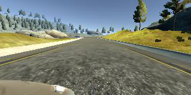

# **Behavioral Cloning**

---

**Behavioral Cloning Project**

The goals / steps of this project are the following:
* Use the simulator to collect data of good driving behavior
* Build, a convolution neural network in Keras that predicts steering angles from images
* Train and validate the model with a training and validation set
* Test that the model successfully drives around track one without leaving the road
* Summarize the results

---
### Files and Overview

The objective of this project is to clone human driving behavior using a Deep Neural Network and the Udacity Car Simulator. To train a model, I can control and navigate a car around a track using the keyboard and mouse. While driving the car, the simulator records training images, steering angles, throttle, break, and speed. I use the recorded data to train a convolutional neural network (CNN). The trained model is then tested on the training track and validation track by running the simulator in autonomous mode.

### Necessary files to run the simulator in autonomous mode

My project includes the following files:
* model.py containing the script to create and train the model
* drive.py for driving the car in autonomous mode
* model.h5 containing a trained convolution neural network
* writeup.md summarizing the results

### Dependencies

This project requires **Python 3.5** and the following Python libraries installed:

- [Keras](https://keras.io/)
- [NumPy](http://www.numpy.org/)
- [SciPy](https://www.scipy.org/)
- [TensorFlow](http://tensorflow.org)
- [Pandas](http://pandas.pydata.org/)
- [OpenCV](http://opencv.org/)
- [Matplotlib](http://matplotlib.org/)

### Training the model
Using the Udacity provided simulator and my drive.py file, the car can be driven autonomously around the track by executing
```sh
python drive.py model.h5
```

#### 1. Collecting Data

The simulator collects data at a frequency of 10hz and records 3 images at each time step from 3 cameras for 3 different viewpoints: left, center, and right.

 Left | Center | Right
------|--------|-------
 |  | 

Along with images from these 3 views, the driving_log.csv in the data directory tracks the steering angle, throttle, break, and speed values at each time step.


The training track has sharp corners, exits, entries, bridges, partially missing lane lines, and changing light conditions. The additional validation track includes changing elevations, sharp turns, steep drop offs, big hills, cliffs, and S-curves. It is crucial that the CNN memorizes and performs well on the training track, and also generalizes to unseen data in order to navigate through the validation track.

One major concern and consideration is the skew and bias of steering angles on the training track. Most of the the training track features straight line driving with only a few left turns and a slight right turn. The following is a histogram of the steering angles recorded while driving down the center of the training track for a few laps.


The left-right skew can be eliminated by horizontally flipping the images and corresponding steering angles. However, after balancing out the left and right steering angles, there is still a strong bias towards driving straight. I do not know if my model will be able to redirect the car back to the center of the road in a testing situation because it has trained predominantly on straight line, middle of the road driving. While ultimately, I can include training data where I veer onto the edges of the road and recover back to the middle to teach the model how to recover, I have included additional preprocessing steps in the case where I cannot add additional training data.

#### 2. Data Preprocessing Pipeline

The simulator records images from 3 cameras at each time step (left, center, and right). First, I randomly select (with equal probability) a single image and its steering angle. I use random selection instead of adding all 3 sets of images into the training data in order to reduce the training time.

 Left | Center | Right
------|--------|-------
 |  | 

Next, I randomly apply a horizontal shear to the images with 90% probability. The pixels at the bottom of images are held fixed while the top half is moved randomly to the left or right. The steering angle is adjust proportionally to the shearing angle. This shearing process makes straightaways artificially appear curvy. I do not use 100% probability in order to keep a small percentage of images that will help the car to navigate the training track.

 Original | Sheared
----------|---------
 | 

Not all of the pixels in the images contain useful information. The top portion contains trees, hills, mountains, and sky and the bottom portion captures the hood of the car. I crop the top 35% and bottom 10% of images to focus only on the portion of the image that is useful for predicting a steering angle. Cropping images also helps to reduce training times.

Next, I randomly apply (with 50% probability) a horizontal flip to the images and steering angles. On the training track, left turns are more prevalent than right turns. Flipping will help to improve the generalizability of my model.

Then, I apply a random gamma/brightness adjustment to the images for extra variability in the data.

Lastly, I resize the images from 160x320 pixels to 64x64 pixels to further reduce training time.

#### 3. Model Architecture

My convolutional neural network (CNN) architecture was inspired by the CNN as described in NVIDIA's End to End Learning for Self-Driving Cars paper. My model contains 5 convolutional layers and 5 fully connected layers. My model includes RELU layers to introduce nonlinearity, and the data is normalized in the model using a Keras lambda layer. I apply Max Pooling layers after each convolutional layer to reduce training time. I also apply dropout on each fully activated layer to reduce overfitting.

| Layer (type)                    | Output Shape       | Param #   | Connected to                     
|---------------------------------|--------------------|-----------|-------------------------
| lambda_1 (Lambda)               | (None, 64, 64, 3)  |  0        |  lambda_input_1[0][0]             
| convolution2d_1 (Convolution2D) | (None, 32, 32, 24) |  1824     |  lambda_1[0][0]                   
| activation_1 (Activation)       | (None, 32, 32, 24) |  0        |  convolution2d_1[0][0]            
| maxpooling2d_1 (MaxPooling2D)   | (None, 31, 31, 24) |  0        |  activation_1[0][0]               
| convolution2d_2 (Convolution2D) | (None, 16, 16, 36) |  21636    |  maxpooling2d_1[0][0]             
| activation_2 (Activation)       | (None, 16, 16, 36) |  0        |  convolution2d_2[0][0]            
| maxpooling2d_2 (MaxPooling2D)   | (None, 15, 15, 36) |  0        |  activation_2[0][0]               
| convolution2d_3 (Convolution2D) | (None, 8, 8, 48)   |  43248    |  maxpooling2d_2[0][0]             
| activation_3 (Activation)       | (None, 8, 8, 48)   |  0        |  convolution2d_3[0][0]            
| maxpooling2d_3 (MaxPooling2D)   | (None, 7, 7, 48)   |  0        |  activation_3[0][0]               
| convolution2d_4 (Convolution2D) | (None, 7, 7, 64)   |  27712    |  maxpooling2d_3[0][0]             
| activation_4 (Activation)       | (None, 7, 7, 64)   |  0        |  convolution2d_4[0][0]            
| maxpooling2d_4 (MaxPooling2D)   | (None, 6, 6, 64)   |  0        |  activation_4[0][0]               
| convolution2d_5 (Convolution2D) | (None, 6, 6, 64)   |  36928    |  maxpooling2d_4[0][0]             
| activation_5 (Activation)       | (None, 6, 6, 64)   |  0        |  convolution2d_5[0][0]            
| maxpooling2d_5 (MaxPooling2D)   | (None, 5, 5, 64)   |  0        |  activation_5[0][0]               
| flatten_1 (Flatten)             | (None, 1600)       |  0        |  maxpooling2d_5[0][0]             
| dropout_1 (Dropout)             | (None, 1600)       |  0        |  flatten_1[0][0]                  
| dense_1 (Dense)                 | (None, 1164)       |  1863564  |  dropout_1[0][0]                  
| activation_6 (Activation)       | (None, 1164)       |  0        |  dense_1[0][0]                    
| dropout_2 (Dropout)             | (None, 1164)       |  0        |  activation_6[0][0]               
| dense_2 (Dense)                 | (None, 100)        |  116500   |  dropout_2[0][0]                  
| activation_7 (Activation)       | (None, 100)        |  0        |  dense_2[0][0]                    
| dropout_3 (Dropout)             | (None, 100)        |  0        |  activation_7[0][0]               
| dense_3 (Dense)                 | (None, 50)         |  5050     |  dropout_3[0][0]                  
| activation_8 (Activation)       | (None, 50)         |  0        |  dense_3[0][0]                    
| dropout_4 (Dropout)             | (None, 50)         |  0        |  activation_8[0][0]               
| dense_4 (Dense)                 | (None, 10)         |  510      |  dropout_4[0][0]                  
| activation_9 (Activation)       | (None, 10)         |  0        |  dense_4[0][0]                    
| dropout_5 (Dropout)             | (None, 10)         |  0        |  activation_9[0][0]               
| dense_5 (Dense)                 | (None, 1)          |  11       |  dropout_5[0][0]                  

#### 4. Using generators to batch load and preprocess data

Even after preprocessing, there is still so much data to that it would take a considerable amount of time to load all the data at once. Plus, it would be inefficient keep it all in memory. I use the Keras fit_generator to create generators for loading data in batch size portions and preprocessing on the fly to feed into my behavioral cloning model.

Each batch contains 64 images, each training epoch takes 20032 images, and validation takes 6400 images. My model uses an Adam optimizer with a learning rate of 0.0001 for 8 training epochs. I found that 8 training epochs was the sweet spot. The loss continued to decrease up until 8 epochs and adding more epochs did not result in additional improvement. I found that higher learning rates plateau at higher losses and produced worse qualitative driving results.

The model was trained and validated on different data sets to ensure that the model was not overfitting, my own recorded driving and the Udacity sample training data. The model was tested by running it through the simulator and ensuring that the vehicle could stay on the track for a full lap. I applied dropout on each fully activated layer to reduce overfitting and used the Adam optimizer so that manually training the learning rate was not necessary.

#### 5. Autonomous mode to test model and results

Finally, after executing
```sh
python model.py
```
I can run the simulator in autonomous mode to test my model by executing
```sh
python drive.py model.h5
```
I received a final training loss of 0.0143 and a validation loss of 0.0175. The following is a short snippet of my model successfully driving around track one without leaving the road. The model drives the full course of the training track staying in the middle of the road at a constant speed of around 9 mph.


The model drives the initial section of the validation track but fails to make it around a sharp left turn in the beginning portion.   


#### 6. Future Directions

I believe I can improve my model by teaching it through examples of navigating sharp turns, steering back to the center of the road after wandering off the side, and handling zig zag road patterns.
